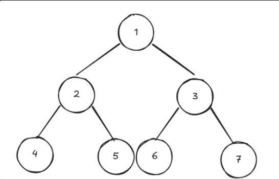
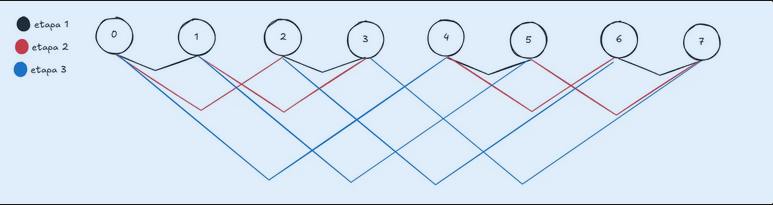
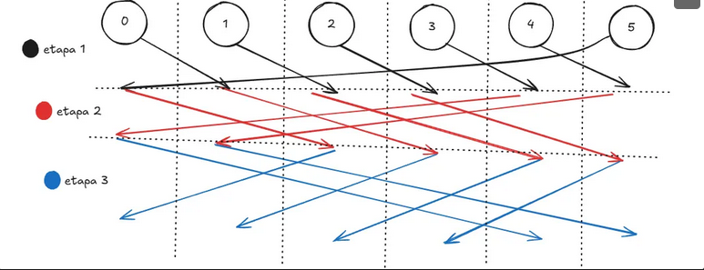

# Barreira de Sincronismo

Barreiras de Sincronismo funcionam como um ponto de chegada limite para todas as threads que estão trabalhando em um mesmo workload, de modo que nenhuma delas consegue ultrapassar esse ponto até que todas tenham passado em conjunto. Deste modo, existem diversas implementações, e python por exemplo tem a sua própria classe definida nativamente.

### Implementação por contador compartilhado

Uma ideia pode ser a implementação por contador, com await. Porém essa implementação tem sérios problemas de race condition e de reset para o próximo workload, que simplesmente não existe.
```C
arrive = 0;

Process Workers [1 to N]{
    // O que quer que seja que o processo faz
    while(True){
        <arrive ++;>
        <await(arrive==N);>
    }
}
```

### Implementação por controle de Flags

Neste contexto flags de sinalização são utilizadas, de modo que existem vetores de flags com N posições (onde N é o número de processos), no qual arrive[N] é o vetor de sinalização de "chegou na barreira", e continue[N] é o vetor de sinalização de "pode continuar" a partir da barreira.
Assim, existem processos coordenadores e processos trabalhadors, de modo que o processo que espera por uma flag, deve ser o mesmo a resetá-la, e a flag não pode ser sinalizada sem ter sido limpa antes.

```C
process Worker[i=1 to N]{
	while(true){
		funcao();
		arrive[i] = 1;
		while (continue[i] == 1) skip;
		continue[i] = 0;
        //<await(continue[i]==1) continue[i]=0;>
	}
}

process Coordinator[i=1 to N]{
	while(true){
		for(int j = 1; j <= N; j++){
			while(arrive[j]==0) skip;
			arrive[j]=0
            //<await(arrive[j]==1) arrive[j]=0;>
		}
		for(int j = 1; j <= N; j++)
			continue[j]=1;
	}
}
```
### Solução com barreira de Árvore 
Essa é uma das piores soluções, já que sua implementação é mais complexa e você deixa grande parte das threads ociosas enquanto as outras soluções você tem N threads trabalhando em N processos, enquanto nessa abordagem apenas os nó folha trabalham.



```C

process Worker[i=1 to N]{
	while(true){
		//Código
		BARREIRA
	}
}

process Leaf{
	BARREIRA: arrive[i]=1;
	<await (continue[i]==1);>
	continue[i]=0;
}

process Root{
	BARREIRA: <await (arrive[esq]==1)   arrive[esq]=0;>
		<await (arrive[dir]==1)   arrive[dir]=0;>
		continue[esq]=1;
		continue[dir]=1;
}

process Inter{
	BARREIRA: <await (arrive[esq]==1)   arrive[esq]=0;>
		<await (arrive[dir]==1)   arrive[dir]=0;>
		arrive[i]=1;
		await(continue[i]==1)   continue[i]=0;
		continue[esq]=1;
		continue[dir]=1;
}
```
O nó folha atualiza o seu próprio arrive pq não tme filhos, e espera até que o pai dele o libere, quando isso contece ele reseta o seu continue.

O nó raiz, como não tem pai, foca o arrive dos filhos, de modo a esperar os filhos sinalizarem que chegou e resetá-las, propagando que elas podem continuar.

O nó interno espera o arrive de seus filhos, igual a raiz, sinaliza o seu próprio arrive para o nó pai dele, e espera o pai sinalizar que ele pode continuar, e reseta o seu próprio continue, e propaga para os filhos que eles podem continuar. 

### Solução de barreiras com Simetria (melhor para distributed systems)
São barreiras implementadas com o foco em multiprocessos com memória compartilhada e tempo de acesso à memória não uniforme. O melhor jeito de deixar um processo com o conhecimento de que todos os outros chegaram é através de uma interconexão binária, de modo que deve-se respeitar $log_2 n$. Deve ser uma potência de base 2 o número de processos.
Código básico de barreira de simetria entre dois processos:

```C
//Barrir code for worker process W[i]
<await (arrive[i] == 0);> 
arrive[i] = 1;
<await (arrive[j] ==1);>
arrive[j] = 0;

//Barrir code for worker process W[j]
<await (arrive[j] == 0);> 
arrive[j] = 1;
<await (arrive[i] ==1);>
arrive[i] = 0;
```


Existem duas barreiras por simetria, dentre elas:

## Barreia Borboleta

Esta barreira funciona apenas quando o número de processos é 2<sup>N</sup>, visto que cada processo se comunica com o seu vizinho, alterando ao longo das etapas. A comunicação entre eles é feita através de código gray. 

Para esta barreira, em cada estágio S, um processo Worker comunica-se com um processo há uma distância 2<sup>s-1</sup>. O número de estágios S é definido por $log_2 n$. Quando N não é potência de 2, pode-se simular adicionando um "worker vazio". Ineficiente.

```
process Worker[i = 0 to N-1] {
    // Inicializa o sentido local
    sentido = 1; 

    while(true) {
        // ... trabalho ...

        // Inicia a barreira
        for (s = 0 to log2(N)-1) {
			j = para_quem_envia(i, s); // borboleta ou disseminação

            // 1. Sinaliza para o parceiro nesta rodada e estágio
            flags[j][sentido][s] = 1;

            // 2. Espera pelo sinal do parceiro
            < await (flags[i][sentido][s] == 1) >;
        }

        // Inverte o sentido para a próxima vez que usar a barreira
        sentido = 1 - sentido;

        // ... pode prosseguir ...
    }
}

```
Segue exemplo:



### Barreira por Disseminação
Segue-se os mesmos princípios de distância, porém cada par de processos um processo seta  flag de arrive da sua direita, espera e depois limpa a sua própria flag. 
Um dos maiores desafios é adaptar o tipo de interconexão entre os processos para evitar condições de disputa que podem originar a partir das múltiplas instâncias da barreira básica entre dois processos.

No código abaixo o vetor de arrive é utilizado como um contador de estágios, de modo que agora o worker[i] espera que o vizinho J do estágio arrive[i] onde ele se encontra esteja pelo menos no mesmo estágio que ele, corrigindo qualquer problema onde o processo J pode também ultrapassar a barreira.

Deste modo, eliminam-se os problemas de um processo ter que esperar sua própria flag de ser resetada, e nem ter que resetar a flag de outros processos.

```C
BARREIRA:
	for(s=1 to num_estagios){
		arrive[i]=arrive[i]+1
		//determinar o vizinho no estágio
		while(arrive[j]<arrive[i]){
			skip;
		}
	}
```

**LER A PORRA DO LIVRO.**


### Implementação por semáforo
Nessa implementação, estudar amanhã.

```C
BARREIRA:	
	for(s=1 to num_estagios){
		j = paraquemenvia(i,s);
		V(s[i][s]);
		P(s[j][s]);
	}
```
