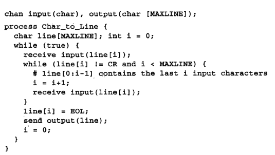

# Concorrência em Memória Distribuída

A situação comum de memória compartilhada localmente é totalmente diferente de memória compartilhada em um contexto distrubído em uma rede de computadores, de modo que o tráfego de valores de semáforos é custoso e causa busy waiting. Para isso, é necessário a utilização de Comunicação Entre Processos (IPC, Interprocess Communication)

### Async and Sync Message Passing Primitives 

É o IPC mais simples, onde canais são necessários, de modo que Canais são filas de FIFO de mensagens pendentes (foram enviadas mas ainda não recebidas). O acesso pode ser efetivado através do uso de primitvas, como **send** e **receive**, podendo ser implementadas de forma síncrona ou assíncrona. 

```C
//declaração de uma variável canal (channel)
chan cn_nome (Tipo[] lista_de_conteudo);
```
- Lista de contéudo: um dos seguintes formatos, onde id é o identificador vulgo nome

--$(tipo_1, id_1,...., type_n, id_n)$
--$(tipo_1,...., type_n)$

Exemplos de claração de canais
```C
chan input(char c);
chan result[n](int c);
chan disk_access(int cylinder, int block, int count, char *buffer);
```

Exemplos de uso de canais
```C
bool empty(chan ch); // retorna se o canal ta vazio ou nao
receive ch(tipo lista_de_variaveis); // retorna a primeira mensagem no canal na ordem dada pelo channel
// mas bloqueia a continuacao do codigo.

send ch(tipo lista_de_parametros); // assincrona
sync_send ch(tipo lista_de_parametros) // sincrona
```

Exemplo de Merge Sort implementado com trocas de mensagens assíncronas

```C
chan in1(int), in2(int), out(int);

process merge_sort() {
    int first, second;
    receive in1(first);
    receive in2(second);

    while(!empty(in1) && !empty(in2)) {
        if (first < second) {
            send out(first); receive in1(first);
        }
        else {
            send out(second); receive in2(second);
        }
    }

    if (empty(in1)) {
        while(!empty(in2)) {
            send out(second); receive in2(second);
        }
    }
    else if (empty(in2)) {
        while(!empty(in1)) {
            send out(first); receive in1(first);
        }
    }
}
    ```

O canal pode ser vazio sem que de fato o processo filho tenha acabado a execução, ou seja, empty() não pode ser a condição de término.
Portanto, definimos EOS como um valor de final de stream, por exemplo, INT_MAX:


```c
chan in1(int), in2(int), out(int);

process merge_sort() {
    int first, second;
    receive in1(first);
    receive in2(second);

    while(v1 != EOS && v2 != EOS) {
        if (first < second) {
            send out(first); receive in1(first);
        }
        else {
            send out(second); receive in2(second);
        }
    }

    if (v1 == EOS) {
        while(v2 != EOS) {
            send out(second); receive in2(second);
        }
    }
    else if (v2 == EOS) {
        while(v1 != EOS) {
            send out(first); receive in1(first);
        }
    }
}
```


Mensagens assíncronas são como semáforos, de modo que as primitivas send e receive podem ser como V e P, de modo que o número de mensagens empilhadas é o valor de semáforo (apenas abstração)

**send** é uma primitiva noblocking
**receive** é blocking.


```C
receive ch ($var_1, ..., var_n$)
```
o efeito de executar receive é atrasar o receptor até que exista pelo menos uma mensagem na fila do channel, de modo que receive pega a primeira mensagem da fila do channel é atribui à uma variável var, que deve ser do mesmo tipo da declaração do channel. Ao bloquear o processo receptor, evita-se o problema de busy-waiting no channel caso não exista nada na fila ainda.

