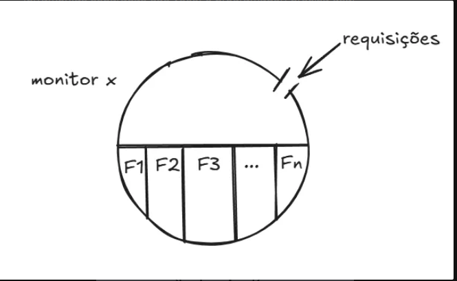
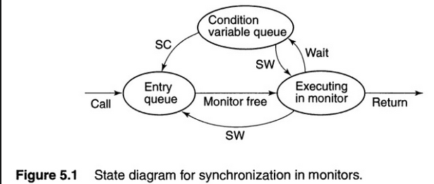

# Monitores 

Basicamente são conjuntos de variáveis e funções que serão utilizadas por diferentes processos, de modo que um monitor pode ser acessado apenas por um processo por vez (exclusão mútua)

Monitores são estruturas que encapsulam problemáticas que poderiam apresentar tratamento falho, como por exemplo, a sinalização de uma variável de condição, travar ou destravar um mutex (semáforo, lock etc). São abstrações de Alto nível.
Logo, ao encapsular os dados compartilhados que fazem parte da região crítica, agrupando os métodos que podem manipular estes dados e efetivar a sincronização por exclusão mútua e variáveis de condição, monitores apresentam um papel fundamental no contexto da programação Concorrente e Paralela.

Um exemplo de código para um monitor segue:

monitor mname{
	//declaração de variáveis permanentes
	//comandos de inicialização
	//procedimento de monitor
}

de modo que:

- O nome dos procedimentos (métodos/funções) são visíveis externamente
- os Comandos de inicialização e dos métodos não podem acessar variáveis externas ao monitor (faz sentido, o que precisa ser controlado é controlado e alterado apenas dentro e pelo monitor)
- Variáveis permanentes são inicializadas antes de executar a primeira chamada ao monitor

Exemplo de chamada de método do monitor

call mname.opname(avgs);

os procedimentos são executados em exclusão mútua

## Algumas funções e especificações de monitores

### Declaração de variáveis condições

cond cv;

empty(cv); 
wait(cv); 
wait(cv,rank); 
signal(cv); 
signal_all(cv); 
minrank(cv);

A lista de comandos acima descreve como alguns métodos do monitor podem ser utilizados, de modo a manipularem a região crítica através da variável condicional cv.

1) o Comando "empty" é responsável por verificar se existe algum processo à espera da região crítica controlada pela variável condicional cv, de modo que retorna 1 caso não exista nenhum processo, e 0 caso alguém esteja eseprando.

2) O Comando wait é responsável por bloquear o processo que fez a chamada ao monitor.

3) O Comando wait(cv,rank) é responsável por bloquear o processo que fez a chamada ao monitor e utilizar o rank da fila de processos à espera da região crítica para encaminhar o acesso ao próximo processo.

4) Signal é responsável por liberar o processo que está esperando na fila da variável condicional.

5) Signal_All é responsável por liberar todos os processos que estão esperando na fila da variável condicional.

6) minrank é responsável por retornar o primeiro processo na fila.

## Políticas de Liberação (Signal)

### Signal and Continue (SC)
O procedimento que fez a chamada continua a sua execução, de modo que em algum momento ele recebe o retorno do que foi chamado, sem sofrer preempção. O processo que executa o signal continua sua execução dentro do monitor. O processo "acordado" é movido para uma fila de entrada do monitor.

### Signal and Wait (SW)
O procedimento que fez a chamada tem a execução interrompida, de modo a esperar a execução do processo que foi liberado.
O processo que executa o signal é imediatamente suspenso, e o controle é transferido para o processo que foi "acordado". Essa abordagem garante que a condição que levou ao signal ainda seja verdadeira quando o outro processo acordar

Diagrama de estados de sincronização para monitores

Um processo chama o monitor e entra na fila caso nenhum processo esteja executando no monitor. Se não, ele entra na fila das variáveis condicionais de modo a liberar o processador e esperar a chamada de liberação do monitor, isso se for um SW. 

Caso a política se Signal seja SC, ele continua a execução mas fica em uma fila de espera de retorno do monitor. 

### Implementação da primitiva de semáforos através de monitores.

monitor Semaphore{
	int s=0;
	cond pos;
	procedure Psem(){
		while(s==0)
			wait(pos);
		s=s-1;
	}
	procedure Vsem(){
		s=s+1;
		signal(pos);
	}
}

Esta solução apesar de ser correta, não garante o melhor atendimento numa política SC. Para também obter isso podemos modificar o monitor para:

monitor FIFOSemaphore{
	int s=0;
	cond pos;
	procedure Psem(){
		if (s==0)
			wait(pos);
		else
			s=s-1;
	}
	procedure Vsem(){
		if(empty(pos))
			s=s+1;
		else
			signal(pos);
	}
} // Fim do monitor

a variável "int s" nesse contexto é usada como um contador de permissões disponíveis.

Caso s seja 0, o processo é colocado em espera, e o lock é liberado para outro processo acessar o monitor. Se s for diferente de 0, uma permissão é decrementada, s=s-1, de modo que a execução é continuada, adentrando a região crítica.

Caso a fila esteja vazia e Vsem seja chamado, S é incrementado de modo a sinalizar que novas permissões estão sendo concedidas. Caso a fila da variável condicional pos esteja ocupada, o próximo processo à espera nessa fila é acordado para retomar sua execução a partir da sua chamada de Psem em seu código.
