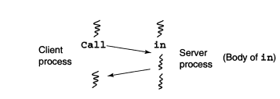

# Rendezvous

A diferença entre RPC e Rendezvous é que no RPC é necessário implementar a sincronização, enquanto no Rendezvous não! Rendezvous também opera por módulos. Ainda, o Rendezous utiliza um processo que já existe no server, invés de criar outro.

Porém agora o corpo do módulo é composto por um único processo que oferece os serviços das operações, e agora existem vetores de operações que são declarados de acordo com o range do nome de uma operção.
Supondo que um módulo exporte a seguinte operação:

```C 
op opname(types of formals);
``` 
O processo do servidor no módulo performa um rendezvous com a chamada de opname executando um *input statement*. 

```C
in opname(formal identifiers) -> S; ni
```

Entre in e ni é chamado de operação guardada, e S é uma lista de estados que provide a invocação de uma operação. 

Um input statement delays o processo servidor até que existe pelo menos uma chamada pendente de opname, de modo que a chamada mais antiga é selecionada copiando os argumentos para o valor de formals, executando a lista de estados S e retornando os parâmetros de resultado para o caller. Após isso, tanto o caller quanto o server continuam a execução.


in op1(formals_1) and B1 by e1 -> S1;
	[] ...;
	[] opn(formals_n) and Bn by en -> Sn;
ni
Funciona de forma síncrona.


O que fica entre in e ni é garantido como guarda, de modo que garante que as condições para a execução das operações sejam cumpridas, exemplo B1 e e1, enquanto S é a sequência de comeandos a ser executada.

Ponto de rendezvous.

```C
// lado do cliente
call mname.opname(params);

// Lado do servidor
// - Definição das operações exportadas 
op opname(tipos_dos_parametros);

// No ponto de Rendezvouz
in opname(id param) -> S; ni 

// em que S é uma sequência de comandos;
```


```C
process Filosofos [i=0 to 4] {
	while (true) {
		call getForks(i);
			eat();
		call relForks(i);
			think();
	}
}

module Table
	op getForks(int), retForks(int);
body 
	process Waiter {
		bool eating[5] = ([5] false);
		while (true) {
			in getForks(i) and eating[right(i)] == false and eating[left(i)] == false -> eating[i] = true
			[] relForks(i) -> eating[i] = false;
			ni
		}
	}
end Table
```


Neste caso agora para o Server do relógio, a criação e manejo da fila não são necessários

```C
module TimeServer
	op getTime() returns int;
	op delay(int);
	op tick(): // chamada para relogio "real"
body
	process Timer {
		int tod = 0;
		while (true) {
			in get_time() returns time -> time = tod;
			[ ] delay(waketime) and waketime <= tod -> skip;
			[ ] tick() -> {
				tod = tod + 1;
				restart timer;
			}
			ni
		}
	}

end TimeServer
``` Neste caso, caso uma chamada seja feita, as condições pra que ela seja atendida e a operação executada devem ser cumpridas, caso isso não aconteça, o processo caller fica em espera, bloqueado! Por isso delay funciona. 

