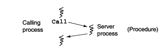

# Remote Procedure Calls

Basicamente muito presentes no uso e implementação Cliente-Servidor, funciona de maneira muito parecido. Uma mistura de monitores + sincronização.

Em monitors basicamente existia o monitor que encapsulava variáveis compartilhadas entre procedimentos deste monitor em específico, de modo que processos comunicavam-se chamando os procedimentos do monitor, e era assumido que processos e monitores estavam no mesmo espaço de endereçamento compartilhado.

Aqui agora este conceito é explorado como módulo, em que o módulo contém tanto processos quanto procedimentos, de modo que processos contidos por outros módulos podem usar os procedimentos originados neste módulo, e vice-versa. 
Deste modo, módulos são divídos em duas partes: a parte de operações exportadas, e o corpo, que é a parte que contém variáveis, procedimentos e processos locais do módulo.
São armazenados os cabeçalhos das operações exportadas.

Exemplo da sintaxe utilizada 

```C
module mname{
    //headers das operações exportadas;
    body
    declaração de variáveis;
    inicialização de código;
    procedimentos para as operações exportadas;
    procedimentos e processos locais;
end mname
}
//A declaração de uma operação exportada pode ser dada por
op opname(formals) [returns result]
```

formals e result especificam os tipos e nomes de parâmetros formais e valores de retorno. 

A declaração de uma operação com RPC é dada por um procedure proc:

```C
proc opname(formal identifiers) returns result identifier
declarations of local variables;
statements
end
``` 

A chamada deste proc pode ser dada por

```C
call mname.opname(arguments)
```

O fluxo de execução de uma call:

Às vezes, quando a chamada é intermódulo, ou seja, a call do procedure é feita externamente visto que os módulos podem estar em diferentes espaços de endereçamento, um NOVO PROCESSO que atende à chamada, recebe os argumentos e encaminha-os como mensagens entre o caller e o NOVO PROCESSO criado no servidor.




Outro ponto importante a ser comentado é a transparência de localidade do RPC, de modo que o programador não sente que o processo executado é em outra máquina, ele faz a chamada remota como se fosse uma função comum, através do uso de stubs, que encapsula os parâmetros fazendo ai a comunicação real com o servidor.

### Servidor de relógio

Segue abaixo o server de um relógio
```C
module TimeServer
    op get_time() returns int;
    op delay(int interval);
body 
    int tod = 0;
    sem m=1, d\[n\] = (\[n\] 0);
    <queue min_heap> (int waketime, int process_id) napQueue;
    proc get_time() return time 
       { time = tod };

    proc delay(int interval) 
    {
        int waketime = tod + interval;
        P(m);
        insert (waketime, my_id) in napQueue;
        V(m);
        P(d[myid]);
    }

    process clock {
        // inicia relogio de hardware
        while (true) {
            // atualiza o relogio 
            tod = tod + 1
            P(m);
            while (tod <= napQueue.top().waketime){ //tod for maior ou igual ao menor waketime da fila. 
                napQueue.pop()
                V(d[id]);
            }
            V(m);
        }
    }
    
end TimeServer
```

**LER NO LIVRO**

Mídia pra caralho pô, de rocha zé, tipo tem a napQueue que são os processos a serem acordados. O get_time só retorna o tempo mesmo,  o delay coloca o processo a ser delayzado para dormir, inserindo-o na napQueue, armazenando a hora de acordar através de tod + interval. Assim, o processo relógio incrementa normalmente a hora do dia, e com exclusão mútua na napQueue, enquando o waketime do topo da fila for maior ou igual a time of day, ele vai liberando os processos. Parece mais uma pilha do que uma queue mas blz.
